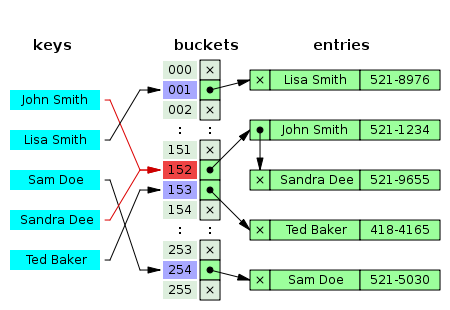

# HashTables

A hash table is a really efficient key-value store, it will take a `key` as input, hash this key through a `hash function` and then put the value in the allocated bucket or linked list. 

> HashTables can cause collisions \(this is by design\). So we need to handle this

## 2.10.1. Conflict Catching

### 2.10.1.1. Separate Chaining

In this method we will use some sort of list of entries with the same index.

### 2.10.1.2. Separate Chaining with linked lists

We will combine every key that fit into the same bucket in a LinkedList. Every ListNode has a key with the designated information.

#### 2.10.1.2.1. Searching

We can search by the hash value of the key, we now end up in the LinkedList containing the value that we want. If we have bad luck, then we find ourselves in a LinkedList where all the keys are collected because they have the same hash \($$O(n)$$\). However in the average case when our hash is of a good quality this won't happen. We can speak of a good quality when our length of the list is $$n/m$$. This is the expectation of the individual List Length. We call this $$n/m$$ equation the load factor $$\alpha$$.

#### 2.10.1.2.2. Inserting

We add a new element at the front, this because our list is not sorted. Adding is $$O(1)$$.

#### 2.10.1.2.3. Removing

If we found the element this is $$O(1)$$.

### 2.10.1.3. Coalesced Chaining

Instead of a table with lists coalesced chaining uses a table of listnodes. By using this method a table can also save a pointer to another element of the table.

#### 2.10.1.3.1. Searching

Start in the address zone, at the index that the hash function gives. And stops if the node of that place has a key or is empty.

#### 2.10.1.3.2. Inserting

We calculate the hash value and look after that right place in the table. If this is empty then we add the element \(this now has a pointer to a empty place that can be used with collisions\). If this has an element already, then we put the element in this empty place.

#### 2.10.1.3.3. Removing

We mark the element as removed \(lazy deletion\), this because if we remove an element then the node would be empty.

### 2.10.2. Open Addressing

We store all entry records in the bucket array itself.

#### 2.10.2.1. Inserting

Examine the bucket, and proceed in the probe sequence until an empty slot has been found.

#### 2.10.2.2. Searching

Scan the buckets until the target is found, or a unused array is found which indicates that there is no such key.

#### 2.10.2.3. Removing

We again keep a variable that shows if the element was removed or not.

#### 2.10.2.4. Probe Sequences

1. Linear probing: Interval between probes is fixed \(usually 1\)
2. Quadratic probing: Increase interval by adding successive outputs of a quadratic polynomial.
3. Double hashing: Compute the interval by another hash function

## 2.10.3. Hash Functions

Hashing is important, since we want to minimise the conflicts. This means that we will have to make sure that ever index it's probability is the same for every key. In other words, the probability that 2 indexes give the same key should be equal to $$1/m$$.

### 2.10.3.1 Static Hashfunctions

Let's consider our keys to be static \(thus equal to a string, integer, ...\). We now have 2 ways that work wel:

#### 2.10.3.1.1. Dividing

This converts a given number s to an index $$\{0, ..., m - 1\}$$. It does this by calculating the rest by dividing through $$m$$: $$h(s) = s\ mod\ m$$. This gives us a random number that has a uniform range.

The size _m_ however should be chosen with care,:

* if m is an even number, then keys == indexes, which means lots of conflicts.
* If $$m = 2^i$$, then index i= last _i_ bits of the key, same goes for power of 10.

Good values are prime numbers that are not to close to the power of 2.

#### 2.10.3.1.2. Multiplying

We multiply the key with C \(0 &lt; C &lt; 1\) and keep the part after the comma. Then we multiply this by m and we take the floor of this.

$$h(s) = floor(m * (sC - floor(s * C)))$$

a good value is: $$C = \frac{(\sqrt(5) - 1)}{2} = 0.61803...$$

### 2.10.3.2. Universal hashing

By choosing a random hash function when creating a hashtable, we make it that this table is independant of the used keys. This table can then behave differently with each execution.

By using this we will reduce the chance of collision even if the data is chosen by an adversary.

We say that a hash functions is chosen from a carefully chosen family of functions. To construct such a family we can for example chose a prime number when we have k keys. Then we get that the hash functions is:

$$h_{a,b}(s) = ((as + b)\ mod\ p)\ mod\ m$$

p = prime number  
 a = number between 1 and p - 1  
 b = number between 0 and p - 1 \(p - 1 included\)  
 s = a key  
 m = number of indices

