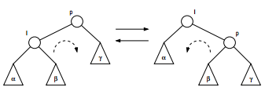

# Red-Black Trees
## General
* Allows us to do all operations (Access, Search, Insertion, Deletion) in O(log(n)) time.
* Is based on a BST (=Binary Search Tree) with a color bit
* Preferred over a AVL tree if we need to do more insertions and deletions

### Properties
* Every node is black or red
* The leafs of the tree (nil's) are **black**
* Red nodes can not have a red parent- or child
* Every path from a node to a "descendent" (nil node) has the same amount of black nodes, we call this the **"black-height"**

We try to keep these properties by using *rotation* or *recoloring*

### Rotation
* We can rotate left or right, this text is for right rotation
* Take I as the new root
* Make the original right child (β) the left child of the new right child (P = old root)
* Left rotation is symmetrical

### Bottom-Up Insertion
Every time we insert a node, we will set its color to red and the root node to black, this because the root always has to be black. Now follow these steps:

**Legend:** N = new node, S = sibling of N, P = parent, U = uncle of parent, G = grandparent

1. Insert as you would in a BST tree, but make the new node = red (so if > go right, if < go left)
2. If P is NOT BLACK or N is not the root
  3. U is red
    * Make U and P black
    * Make G red
    * Repeat from G
  4. U is black
    * Left Left Case (P is left child of G and N is left child of P)
      * Right Rotate G and Switch colors P and G
    * Left Right Case (P is left child of G and N is right child of P)
      * Left Rotate P --> Back to the Left Left case
 
### Bottom-Up Deletion
### Top-Down Insertion
### Top-Down Deletion
